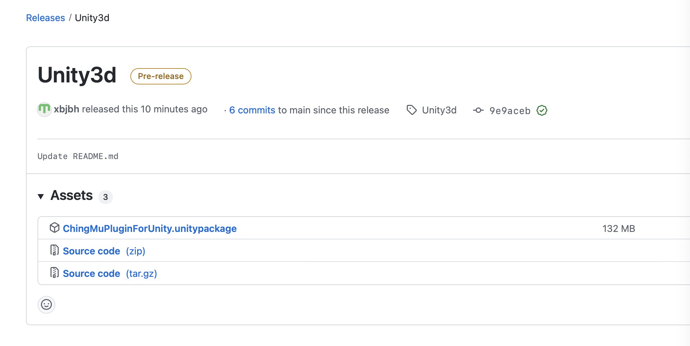
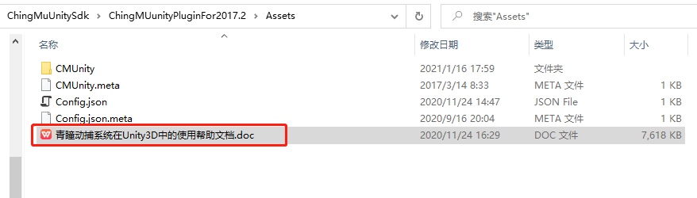
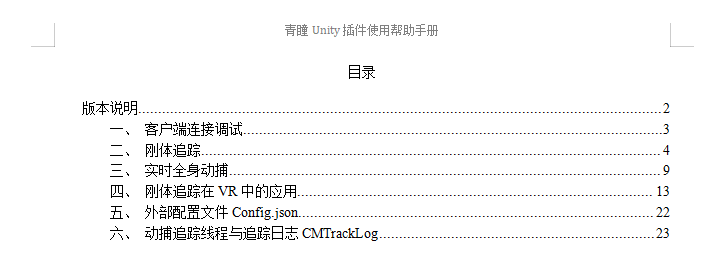

## ChingMU Unity 插件说明

**插件下载：**
<!--
[ChingMuPlugin For Unity5.6](https://github.com/ChingMuVisionTech/ChingMuUnitySDKs/releases/download/Unity5.6.3/ChingMuPluginForUnity5.6.3.unitypackage)   
[ChingMuPlugin For Unity2017](https://github.com/ChingMuVisionTech/ChingMuUnitySDKs/releases/download/Unity2017.2/ChingMuPluginForUnity2017.2.unitypackage)      
[ChingMuPlugin For Unity2018](https://github.com/ChingMuVisionTech/ChingMuUnitySDKs/releases/download/unity2018.2/ChingMuPluginForUnity2018.2.unitypackage)      [ChingMuPlugin For Unity2019](https://github.com/ChingMuVisionTech/ChingMuUnitySDKs/releases/download/unity2019.2/ChingMuPluginForUnity2019.2.1.unitypackage)   
[ChingMuPlugin For Unity2020](https://github.com/ChingMuVisionTech/ChingMuUnitySDKs/releases/download/Unity2020.3/ChingMuPluginForUnity2020.3.unitypackage)   
[ChingMuPlugin For Unity2021](https://github.com/ChingMuVisionTech/ChingMuUnitySDKs/releases/download/Unity2021.1/ChingMuPluginForUnity2021.1.unitypackage)   
[ChingMuPlugin For Unity2021](https://github.com/ChingMuVisionTech/ChingMuUnitySDKs/releases/download/Unity2021.1/ChingMuPluginForUnity2021.1.unitypackage)
-->
[ChingMuPlugin For Unity3d](https://github.com/ChingMuVisionTech/ChingMuUnitySDKs/releases/download/Unity3d/ChingMu_Unity3d.unitypackage)

[插件操作手册](https://github.com/ChingMuVisionTech/ChingMuUnitySDKs/releases/download/unity/for.Unity.doc)

### 1 引言

（1）ChingMU Unity插件提供了青瞳动捕在Unity中的各种功能API接口。 
（2）ChingMU Unity插件支持Unity2018及以上版本。

### 2 用途与功能

你可以使用ChingMU Unity插件在Unity中利用青瞳动捕提供的定位与动作捕捉来实现各种相关应用，如虚拟影视拍摄实时预览，虚拟角色直播，VR头显定位，或者无人机等物体的定位。

### 3 如何开始

（1）在Git下载ChingMuPluginFouUnity.unitypackage，如下图所示： 
 

（2）将下载好的ChingMuPluginFouUnity.unitypackage导入到对应版本的Unity，如下图所示： 
 

（3）找到并打开 青瞳Unity使用帮助手册，如下图所示： 
 

（4）跟随文档中的目录章节，学习插件中提供的相关功能。 
 
