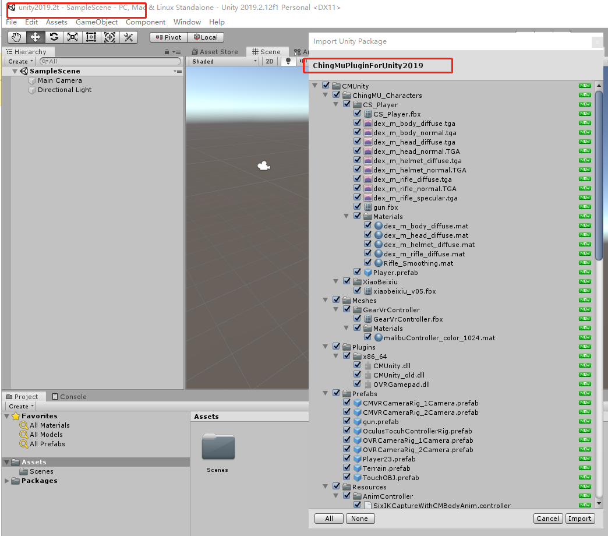

# ChingMuPluginForUnity2017
功能描述：在unity中使用青瞳刚体追踪与全身动捕
数据流包括：实时人物关节数据和刚体的数据  
## 一、简介  
&emsp;&emsp;本文中介绍的ChingMuPluginForUnity插件是由上海青瞳视觉自行研发的，此插件可以实时接收青瞳动捕server的动作捕捉数据与刚体追踪数据，然后将收到的数据应用在unity的游戏对象上。
## 二、插件在Unity 2017 中的使用
### 1.安装插件
&emsp;&emsp;将ChingMuPluginForUnity2017.unitypackage包导入unity2017.2或unity2017.2以上的版本。

 
  

图 1-1 导入插件
 

### 2.在追踪client里面添加动捕演员与刚体
&emsp;&emsp;如下图所示。  

 
  

图 2-1 添加人物
  

 
  

图 2-2 添加刚体
  

### 3.修改配置文件
&emsp;&emsp;修改配置文件Config.json。  

 
  

图 3-1 修改配置文件
 

### 4.打开插件中的demo场景

 
  

图 4-1 插件demo场景
 

&emsp;&emsp;其他具体操作查看插件使用帮助文档  

 
  

图 4-2 插件文档
 
